# Fireflies

## Fireflies - A VFX USD based pipeline
 
 


Fireflies is a VFX pipeline developed as a graduation project, the purpose was to create a pipeline capable of supporting the needs of mainly CGI oriented projects with Pixar's RenderMan. 

The pipeline is built around a USD and workflow, to enhance the connectivity, exchange, and efficiency, through the USD api and Kitsu.

The main objectives with this project are to: 
* Create a fully fledged pipeline capable of supporting the needs of artists and technical needs
* Be flexible and remain user friendly with all the USD concepts
* Support USD exchanges and production tracking across all the DCCs
* Support complex workflows and keep up with the artists needs
* Be able to track entities and files across different networks
-----

* Supported DCCs: Houdini / Maya / Fireflies Resolver
* Production Tracker: Kitsu (Gazu API)
* Render Farm Manager: Deadline
* Core APIs: Pxr, PySide, Hou, Cmds

### Launcher
In order to launch the different DCCs with the correct environment, we use the Fireflies Launcher. 
The Launcher asks for different values regarding directories or login, that are stored in dedicated files.
<p align="center">
    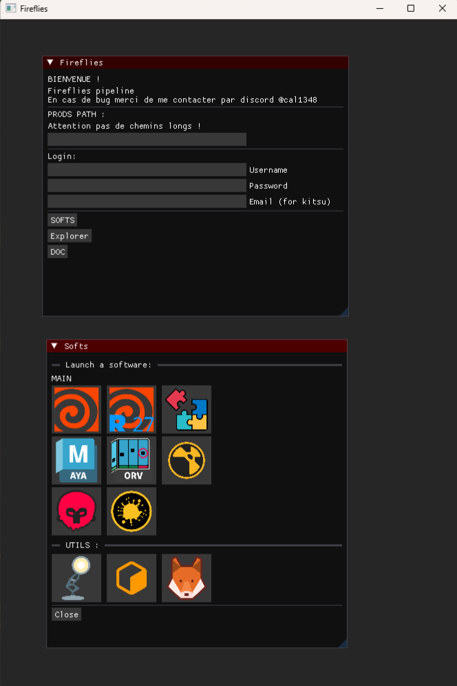
</p>

### Production Tracking and Entity Management
Each user has a synchronised copy of the production they are currently working locally on, and a access to the production files on a server, which maintains high speed data flow and avoids server bottleneck for each user. 

The production tracker used in the pipeline is Kitsu, mainly because of the ease of use for the artists and its powerful capabilities. 


**Context Management**
The main production structure is build around: 
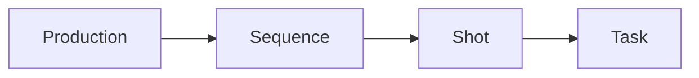
Or for the assets:
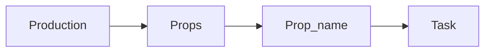
Each task is tracked and its status is visible in the [context tool](https://github.com/CAL20120/Fireflies/blob/c286b7d3ecd2d39b7edbbf8fa3d866596732accd/Fireflies_BIN/fireflies/context/context_window.py)

The context tool can be used to access scenes, view a task status, assignments, all the related kitsu information, and create sequences, shots, tasks directly from the DCCs. 
This tool, as the majority of the tools with Fireflies, are compatible accross all the supported DCCs, which makes them easy to maintain and easy to use for the artists.

<!-- [](https://www.youtube.com/watch?v=10RX-16kAOw) -->
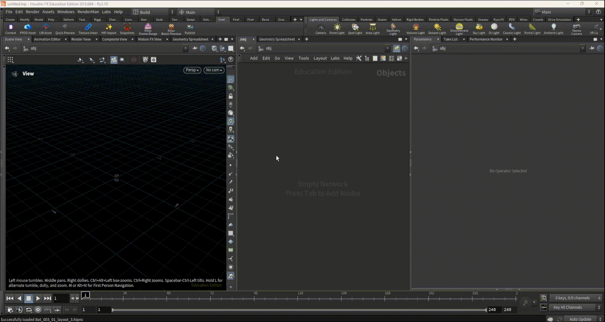

---------------

***Production Tracking and Kitsu connectivity***

Each user has to enter their credentials in the *Fireflies Launcher* (cf Fireflies Launcher Repository)
This values are read and used to establish a connection with Kitsu.
Because each user is on a different network, they use a custom VPN configuration to be able to connect.

To track the user current context, we use two technics:
* Based on the current scene and the pipeline directories hierarchy we can easily track the current tasks and local context of the artist.
* With this given path context, we can then fetch the related Kitsu context.

These two technics are usually used together, we first gather the path / local context usually to run tests, and then get the Kitsu context to preview / update the targeted informations (entities, data dict, status...)


* The main production tracking script is [prod_tracker.py](https://github.com/CAL20120/Fireflies/blob/c286b7d3ecd2d39b7edbbf8fa3d866596732accd/Fireflies_BIN/fireflies/context/prod_tracker.py)

According to the two systems we saw, there are two main python class corresponding

```python
class manage_paths()

class manage_context()
```

The purpose of getting the 'path conext' is to get all the important elements that we need to eventually evaluate a Kitsu context or in some cases to run checks (it will return for instance, the current task, shot / asset name, version...), otherwise, we can use these informations to run a Kitsu query. 

Example: 
```python
CT_PATH = manage_paths(scene_path)

self.get_context_info(prod_name=CT_PATH.ct_prod)
```


Mainly this script contains all the methods used to let communicate and exchange data with Kitsu.
All the queries are sent through the Gazu python API.

When fetching the current Kitsu the *get_full_ct* method will return this dict:
```python
info_dict = {
    'status': current_status,
    'start_date': start_date,
    'end_date': end_date, 
    'assigned_users': out_user_name, 
    'frame_range': kt_frame_range,
    'fps': kt_fps,
    'task_entity': kt_task_entity,
    'current_entity': target_entity, 
    'is_asset': asset:bool
}
```
The purpose is to get all the important and useful informations we need quickly. 

The rest of the pipeline uses this script as a bridge with kitsu. 

```python
from fireflies.context import prod_tracker
CONTEXT = prod_tracker.manage_context()
```
As we saw before, we have a local context and a Kitsu context, to get each one we do as so: 
```python
CT_PATH = prod_tracker.manage_paths(path)
current_task = CT_PATH.ct_task
```
* The *manage_paths* class let's us get quickly each information about the current local context (sequence name, shot name...)

But if we wanted to get the current Kitsu contextL 
```python
from fireflies.context import prod_tracker
CONTEXT = prod_tracker.manage_context()

kt_infos = CONTEXT.get_full_ct(scene_path)
```
Because Kitsu usually returns python dicts, we can easily process the informations.

This script also handles all the connections related to publishing entities, previews or status changes needed by the different tools (publishing, resolver...)

There are also a few Kitsu related tools in the DCCs, such as:

* Kitsu Batch Preview: Creates a video preview file with the context informations and sends it to Kitsu
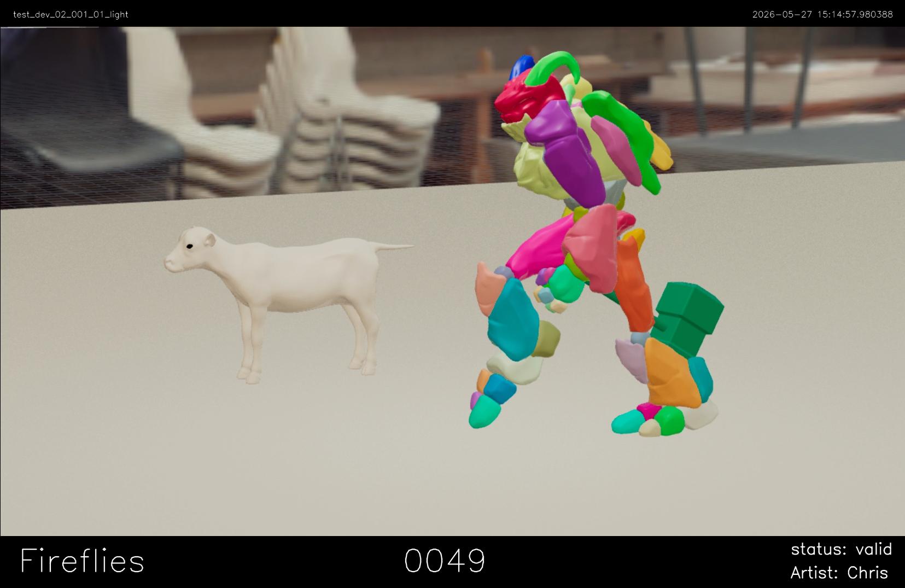
* Kitsu Frame Range: Makes sure that the timeline is set to the right frame range

--------

***Publish and entity tracking***

The publishing system is based on [Pyblish](https://github.com/pyblish/pyblish)
The mainly used scripts in the publishing system are : [abstract_publish](https://github.com/CAL20120/Fireflies/blob/c286b7d3ecd2d39b7edbbf8fa3d866596732accd/Fireflies_BIN/fireflies/publish_regular/abstract_publish.py), [abstract_hou_publish](https://github.com/CAL20120/Fireflies/blob/c286b7d3ecd2d39b7edbbf8fa3d866596732accd/Fireflies_BIN/fireflies/houdini/abstract_hou_publish.py) and [abstract_maya_publish](https://github.com/CAL20120/Fireflies/blob/c286b7d3ecd2d39b7edbbf8fa3d866596732accd/Fireflies_BIN/fireflies/maya/abstract_maya_publish.py)
* Houdini and maya share one script for the global publishing methods, and each has its own classes.

* In houdini to target the work the artist wants to publish we have an HDA *publish_work*, used to target in the graph the part that they want to publish. While in maya, we use the pipeline nomenclature to find the targeted assets.

There are two main publishers, the regular ASSET / SHOT published (tracking depends on the context)
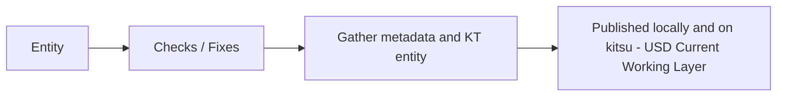
* Because users don't work on the same network, the files tracking is assured by a custom [tracking script](https://github.com/CAL20120/Fireflies/blob/c286b7d3ecd2d39b7edbbf8fa3d866596732accd/Fireflies_BIN/fireflies/fireflies_utils/usd/usd_asset_importer_hou.py)

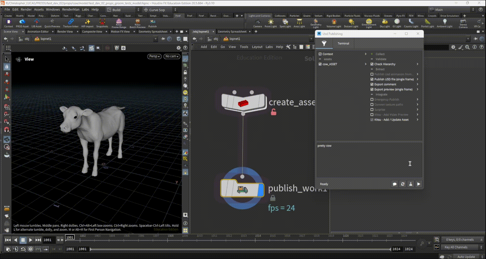


And the RIG / ANIMATION publisher:

* To keep the USD structure, when the rig is published, we create the correct namespace, so that later when the animation is being published, we can convert the namespace back to the correct USD prim hierarchy.
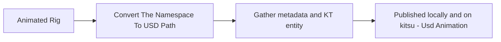

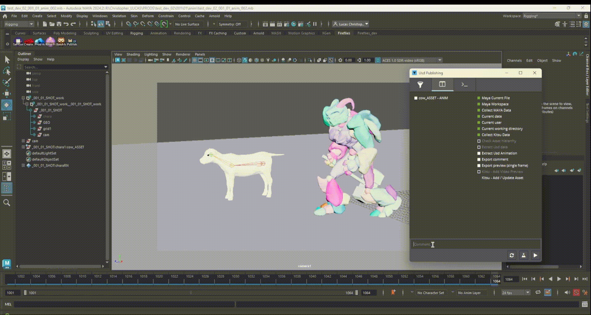


* Both publishers share [common publishing orders](https://github.com/CAL20120/Fireflies/tree/c286b7d3ecd2d39b7edbbf8fa3d866596732accd/Fireflies_BIN/fireflies/publish_regular), and dedicated publishing orders based on the current DCC and context (rig for instance)

* [Houdini publishing scripts](https://github.com/CAL20120/Fireflies/tree/c286b7d3ecd2d39b7edbbf8fa3d866596732accd/Fireflies_BIN/fireflies/publish_hou)
* [Maya publishing scripts](https://github.com/CAL20120/Fireflies/tree/c286b7d3ecd2d39b7edbbf8fa3d866596732accd/Fireflies_BIN/fireflies/publish_maya)


In addition to that, each DCC has its UTILS python file, which contains all the useful functions used throughout the entire pipeline. Some of these methods are used in the publishing system. 

* Houdini UTILS ([hou_utils.py](https://github.com/CAL20120/Fireflies/blob/c286b7d3ecd2d39b7edbbf8fa3d866596732accd/Fireflies_BIN/fireflies/houdini/hou_utils.py))
* Maya UTILS ([maya_utils.py](https://github.com/CAL20120/Fireflies/blob/c286b7d3ecd2d39b7edbbf8fa3d866596732accd/Fireflies_BIN/fireflies/maya/maya_utils.py))


For the animation workflow: 

When publishing an animation, to be able to track shot dependant entities (such as animations) we take advantage of the family system that pyblish uses, we need to create different families to later be able to process animation data with the correct publishing orders.
```python
#if it's a regular asset
instance.data["family"] = "assets"

#if we detect a shot dependency based of the maya namespace
instance.data['family'] = "shot_dependency"
```

The publishing orders only run the pyblish process, each order calls a corresponding method located in the corresponding abstract publishing script based on the order and the DCC

For instance: 
```python
import pyblish.api 

from fireflies.publish_regular import abstract_publish as ab

from fireflies.context.prod_tracker import CT_HOU, CT_MAYA

class Kt_Integrate_Preview(pyblish.api.InstancePlugin):
    """Add a video the the related asset on kitsu"""

    order = 3.1
    optional = True
    active = False
    label = "Kitsu - Add Video Preview"

    def process(self, instance):
        context = instance.context

        asset_name = instance.name
        scene_path = context.data.get('scene_path')

        asset_family = instance.data.get('family')

        if context.data.get('is_shot') and CT_MAYA and asset_family == "shot_dependency":
            asset_name = context.data.get('shot_publish_name')
        
    
        video_preview_path = ab.export_video_preview(asset_name=asset_name, scene_path=scene_path)

        print("### video preview: {} ###".format(video_preview_path))

        instance.data['video_preview_path'] = video_preview_path
```

* The publishing order will always call the corresponding method it needs and add to the current pyblish context or instance the informations we will need later on.


To fetch the published entities, we use the pipeline [asset manager](https://github.com/CAL20120/Fireflies/blob/c286b7d3ecd2d39b7edbbf8fa3d866596732accd/Fireflies_BIN/fireflies/fireflies_utils/usd/usd_asset_importer_hou.py):
<p align="center">
    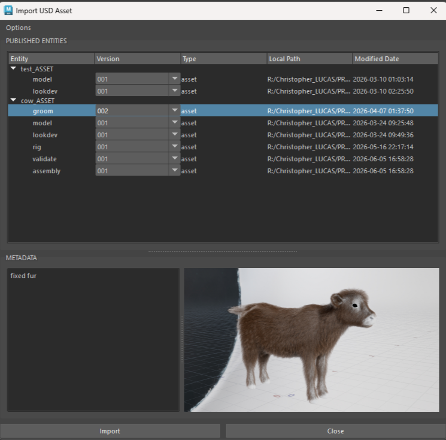
    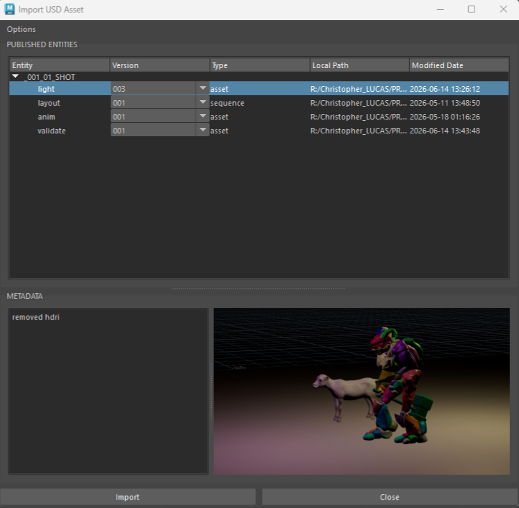
</p>

To manage assets within houdini we use the *fireflies asset import* HDA
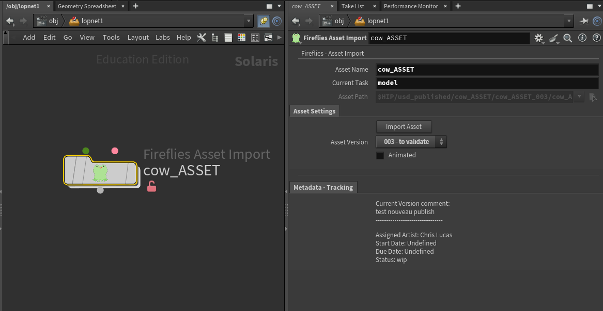
* This nodes allows the artists to switch between versions easily and quickly, while being able to see the related metadata.

For all the library related assets, there is an importer dedicated to manage this: 
<p align="center">
    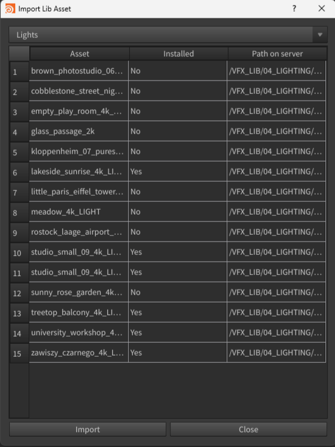
</p>

* The lib importer is mainly used to manage lighting ressources and assure their compatibility with RenderMan's formats.

-------------------

***Fireflies Resolver and Validation Process***

The [Fireflies Resolver](https://github.com/CAL20120/Fireflies/blob/c286b7d3ecd2d39b7edbbf8fa3d866596732accd/Fireflies_BIN/fireflies/asset_resolver/resolver_main.py) is an application (python) built to let the artists manage the validation process for the entities. 
This software lets the artists browse through the entities their tasks versions, and validation steps. 

* The purpose of this workflow is to let the artists manage their assets individually to adapt to the needs of each.
* It gives an easy way to visualize the different validation steps, which results in a full control of the validation process for the artists.

Validation workflow:
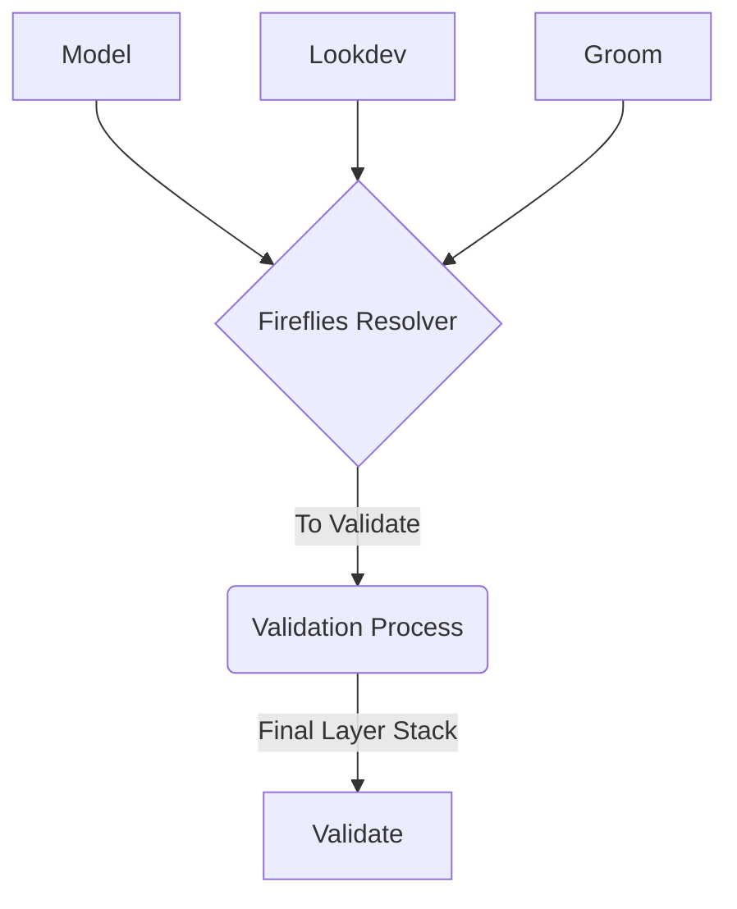
* The To Validate and Validate / Assembly are all USD stages composed of a layerStack with tasks chosen by the artists. 

* The To Validate and Validate stages are used for testing, each departement can get this state of the asset for testing purposes, the validate stage is meant to be the common version all artists use to be up to date.

 * The Assembly stage is the version that goes to delivery. 
 
For the shots the workflow is quite similar.

**Fireflies Resolver - Structure**

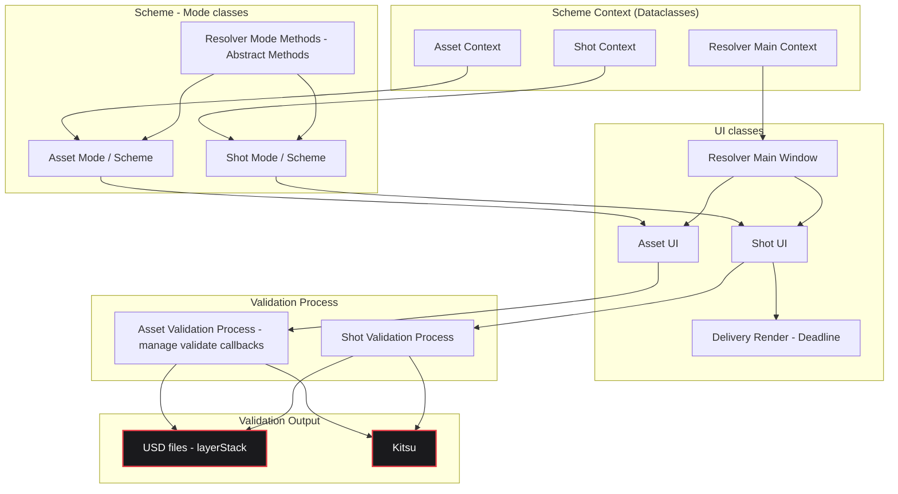

Each mode has its own UI, and backend class (Scheme). The corresponding scheme inherits from an abstract methods to ensure compatibility between both schemes.

The main window displays the selected Mode and therefore UI. 

The Schemes and the resolver main UI all have a corresponding dataclass, which we refer to as a context. The shot and asset schemes have access to the resolver main context which holds the production and Kitsu informations. 
The mode contexts all hold informations related to the targeted kitsu entities or utility values. The contexts are being updated with the UI and backend callbacks.

This approach allows for a more dynamic UI and backend logic, as well as a more managable and scalable software.


**Asset Validation Process**
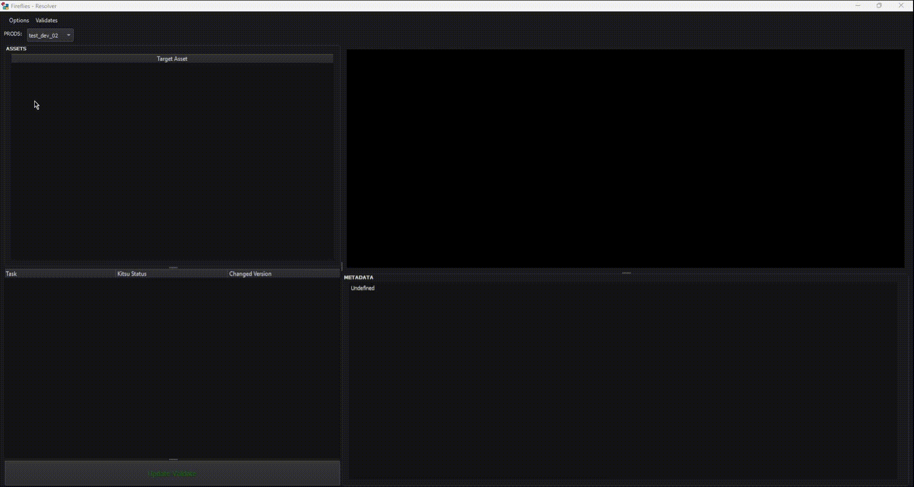
* To begin the validation process you need to create a 'validate'

Once the validation process has begun, the artist can add the tasks he wants to this process and update them. 
When the task is ready to be validated, the artist can simply click onto 'validate selected task' and the validate / assembly layerStacks and the Kitsu data will be updated.


**Shot Validation Process**


* The shot validation process is very similar to the asset validation process, the difference being that there is no assembly, and that you can order a delivery render afterwards.

Yet the differences are in the user experience, you can see the rendered or batched previews of the selected tasks, the shots and tasks are arranged in a QTreeWidget for clarity. 


**Render Delivery**

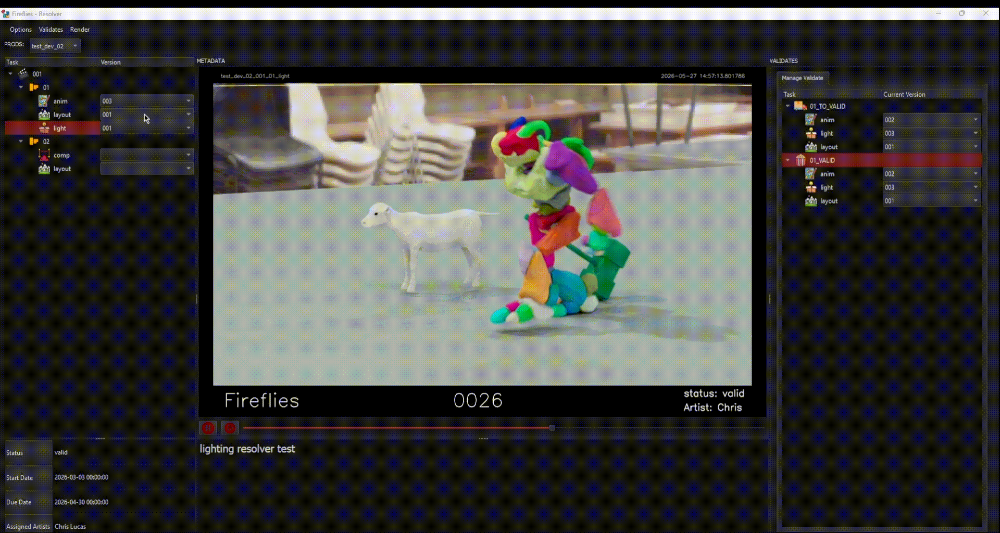

The render delivery action creates a houdini file in which the validate stage will referenced, and the pipeline render HDA will be created, the parms in the delivery UI are indeed the render HDA's parms. We store the parameters that need to be shown in a dict in the deadline_hou_submitter script. 

```python
self.rm_render_parms_main = {
    "trange": {
        'value': "1", 
        'name': "Frame Range",
        'choices': [("0", "Render Current Frame"), ("1", "Render Frame Range")], 
        'type': 'menu'
    },
    "f1": {'value': f_start, 'name': 'Start Frame', 'type': 'float'},
    "f2": {'value': f_end, 'name': 'End Frame', 'type': 'float'},

    "cam": {'value': "/cameras/camera2", 'name': 'Camera', 'type': 'camera'},
    "resolution1": {'value': res_w, 'name': 'Resolution Width', 'type': 'int'},
    "resolution2": {'value': res_h, 'name': 'Resolution Height', 'type': 'int'},

    "xn__rihiderminsamples_n3af": {'value': "128", 'name': 'Min Samples', 'type': 'int'},
    "xn__rihidermaxsamples_n3af": {'value': "256", 'name': 'Max Samples', 'type': 'int'},

    "xn__riRiPixelVariance_n3ac": {'value': "0.01", 'name': 'Pixel Variance', 'type': 'float'},

    "dl_job_name": {'value': f"DELIVERY - {shot_name}", 'name': 'Job Name', 'type': 'str'},
    "dl_machine_list": {'value': "", 'name': 'Assign Workers', 'type': 'str'}
}

self.rm_render_parms_locked = {
    "unlock_path": 1,
    "output": "",
    "xn__rihiderminsamples_control_ohbf": "set",
    "xn__riRiPixelVariance_control_ohbc": "set",
    "xn__rihidermaxsamples_control_ohbf": "set",
    "dl_machine_sel": "1"
}
```

Then each parm will be displayed with the correct widget, and once the delivery is ordered the parms will be reformatted to a standard dictionnary in a json file (in the validate folder). Then the parms are applied back to the render HDA in the delivery scene (The method used is located in hou_utils.py).

Eventually the render is sent to deadline with the correct jobs.

---------------------

**Managing Renders - Render Farm**

The dispatcher used is Deadline Render. 

Similarly to Kitsu, for the artists, Deadline requires to use the pipeline VPN configuration.

Every user has works on a synchronised copy of the production they are working on, yet to be able to render with multiple workers on different networks, we use RaiDrive to have a direct access to the server files as a network drive. 
Every path set in the DCCs need to be relative, and checks are used to make sure that nothing breaks on this regard, otherwise, the workers will not be able to access the files they need to render.

The process to render frames from houdini is the following: 
1. Generate the USD files locally (The scene is being copied to a dedicated directory) - Hip path is set back to the original scene path.
2. Write them on the server let husk render them (on the server)
 

Why don't we write the files directly on the server ?
Because of the writing speeds, after some testing, writing the files locally and copying them to the server seems to be the fastest option in this case (slow server).


The USD files generated for the rendering are not synchronised for space reasons, otherwise the artist's disks would clog quickly. 

In the end, we have two jobs, one for generating the usd files, and one for rendering them. 

The script that handle's this is [deadline_hou_submitter.py](https://github.com/CAL20120/Fireflies/blob/c286b7d3ecd2d39b7edbbf8fa3d866596732accd/Fireflies_BIN/fireflies/houdini/deadline_hou_submitter.py)

This script handles the job files, and processes. 

```python
render_plugin = self.hou_render_plugin_info(usd_file=husk_render_input, out_images=husk_out_images)

render_job_cmd = [self.deadline_ex, render_job, render_plugin]

render_proc = subprocess.Popen(
    render_job_cmd, stdout=subprocess.PIPE, stderr=subprocess.PIPE, text=True
)

stdout_job, stderr_job = render_proc.communicate()
```


As mentioned before, in houdini, we use a custom HDA to handle and simply RenderMan's render settings and also the farm settings. 
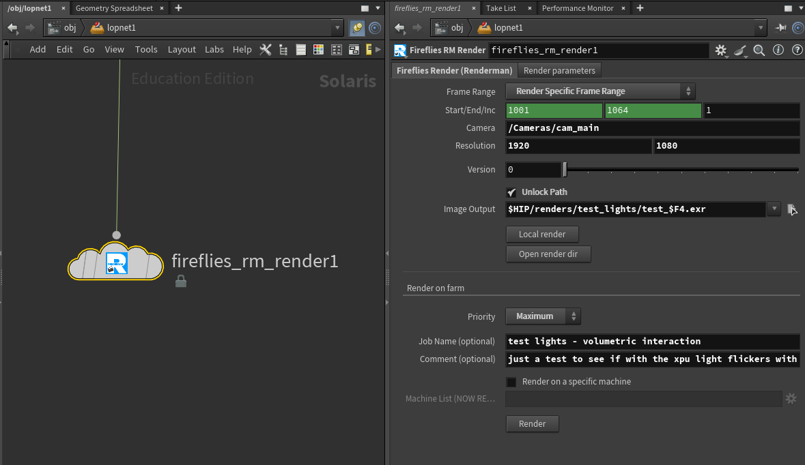

* Upon rendering, the deadline scripts collects all the node's parms to set the correct job and render settings, all the required files are created and the jobs are sent. 


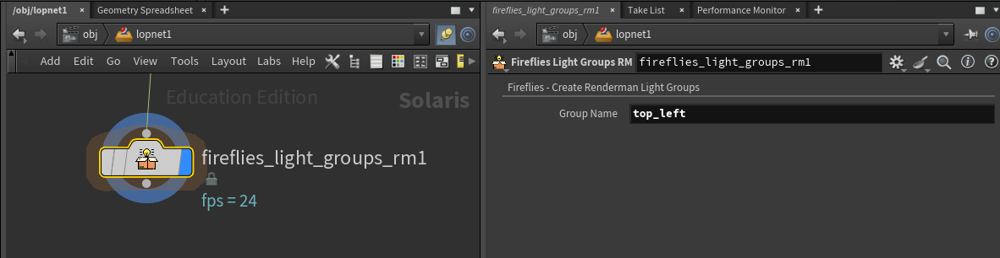

* A problematic with RenderMan is it's quite new integration in Solaris and XPU render issues, for instance, the light group system. Unlike in a ROP context in solaris you would need to add a custom render var with the correct LPE to create custom light groups. Therefore Fireflies offers a few tools to cope with these misses, the light groups HDA for instance. 

```python
def create_light_group_var(self):
    #this method is used in the fireflies rm render node as a callback
    
    current_node = hou.pwd()
    stage = current_node.editableStage()

    node = current_node.parent()

    # print(stage)

    node_ancestors = node.inputAncestors()

    grp_name = node.evalParm('grp_name')

    if not grp_name:
        return
    
    print(grp_name)

    for ancestor in node_ancestors:
        if "light" in ancestor.type().name():
            print(ancestor)

            group_create = ancestor.parm('xn__inputsrilightlightGroup_control_krbcf')
            group_input = ancestor.parm('xn__inputsrilightlightGroup_jebcf')

            if not group_input:
                continue

            group_create.set('set')
            group_input.set(grp_name)

    
    grp_var_path = f"/Render/Products/Vars/light_grp_{grp_name}"
    
    target_var = UsdRender.Var.Define(stage, grp_var_path)
    
    target_var.CreateSourceNameAttr().Set(f"C[DS]*<L.'{grp_name}'>")
    target_var.CreateSourceTypeAttr().Set(UsdRender.Tokens.lpe)

    target_var.GetPrim().CreateAttribute('driver:parameters:aov:name', Sdf.ValueTypeNames.String).Set(grp_name)
    target_var.CreateDataTypeAttr().Set("color3f")

    print("VAR CRTEATED: {}".format(grp_name))
```
It creates a render var for the given light group name and sets the lights correctly to create a fully functionnal light group. 

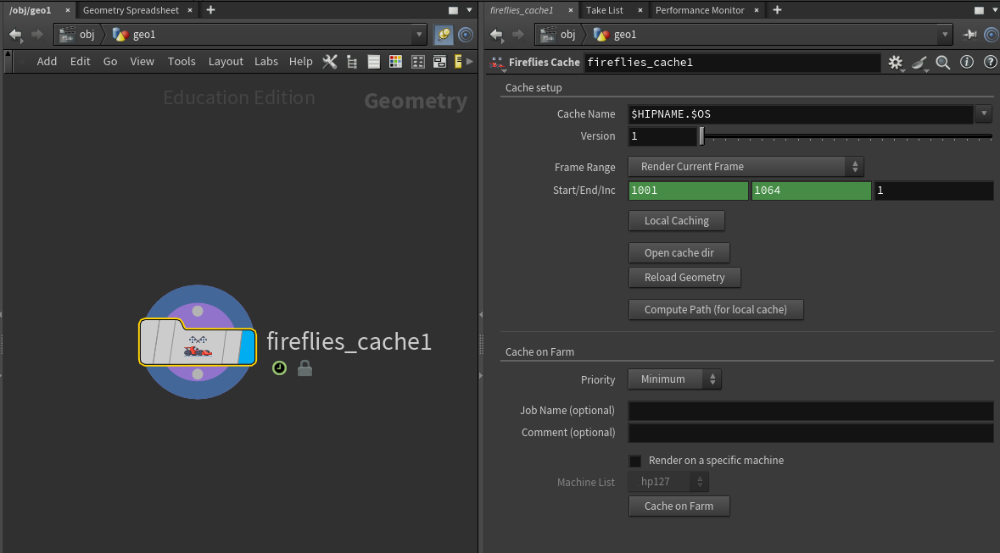
* There is also a support for houdini sop caches with deadline.


----------------------

## Conclusion

Fireflies is a project developed as a graduation project, to make a bridge between modern VFX workflows with a USD oriented philosophy, and the creative needs of the artists that have been using it every day. 